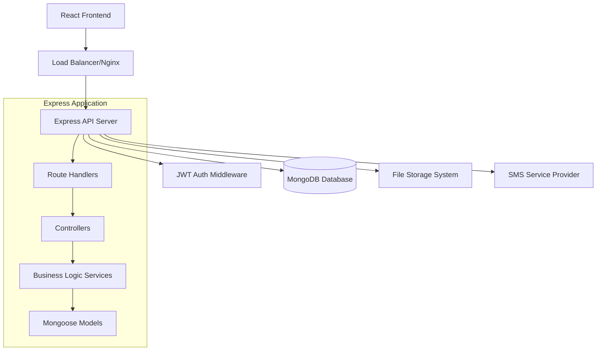

# Design Document

## Overview

The Node.js Express MongoDB backend will replace the existing Supabase infrastructure with a custom solution that provides the same functionality while offering more control and flexibility. The system will be built using modern Node.js practices with TypeScript, following RESTful API principles and implementing JWT-based authentication.

## Architecture

### High-Level Architecture



### Technology Stack

- **Runtime**: Node.js 18+ with TypeScript
- **Framework**: Express.js with TypeScript
- **Database**: MongoDB with Mongoose ODM
- **Authentication**: JWT tokens with bcrypt for password hashing
- **File Storage**: Multer for uploads + local/cloud storage
- **SMS Service**: Twilio or similar for OTP delivery
- **Validation**: Joi or Zod for request validation
- **Documentation**: Swagger/OpenAPI 3.0
- **Testing**: Jest with Supertest
- **Environment**: Docker containerization

## Components and Interfaces

### 1. Authentication Service

**Purpose**: Handle user authentication, JWT token management, and OTP verification

**Key Components**:
- JWT token generation and validation
- Password hashing with bcrypt
- OTP generation and SMS integration
- Session management

**Interfaces**:
```typescript
interface AuthService {
  login(email: string, password: string): Promise<AuthResponse>
  register(userData: RegisterData): Promise<AuthResponse>
  sendOTP(phone: string): Promise<void>
  verifyOTP(phone: string, otp: string): Promise<AuthResponse>
  validateToken(token: string): Promise<UserPayload>
  refreshToken(refreshToken: string): Promise<AuthResponse>
}

interface AuthResponse {
  user: User
  accessToken: string
  refreshToken: string
  expiresIn: number
}
```

### 2. User Management Service

**Purpose**: Manage user profiles, roles, and permissions

**Key Components**:
- User CRUD operations
- Role assignment and validation
- Profile management

**Interfaces**:
```typescript
interface UserService {
  createUser(userData: CreateUserData): Promise<User>
  getUserById(id: string): Promise<User>
  updateUser(id: string, updates: UpdateUserData): Promise<User>
  assignRole(userId: string, role: UserRole): Promise<void>
  checkPermission(userId: string, permission: string): Promise<boolean>
}

interface User {
  id: string
  email: string
  phone?: string
  fullName: string
  roles: UserRole[]
  createdAt: Date
  updatedAt: Date
}
```

### 3. Submission Management Service

**Purpose**: Handle multi-step form submissions and data persistence

**Key Components**:
- Form data validation and storage
- Multi-step submission tracking
- File association management

**Interfaces**:
```typescript
interface SubmissionService {
  createSubmission(userId: string, data: SubmissionData): Promise<Submission>
  updateSubmission(id: string, data: Partial<SubmissionData>): Promise<Submission>
  getSubmission(id: string): Promise<Submission>
  listSubmissions(filters: SubmissionFilters): Promise<PaginatedResult<Submission>>
  deleteSubmission(id: string): Promise<void>
}

interface Submission {
  id: string
  userId: string
  personalInfo: PersonalInfo
  projectDetails: ProjectDetails
  mcqAnswers: MCQAnswers
  fileIds: string[]
  status: SubmissionStatus
  submittedAt: Date
  createdAt: Date
  updatedAt: Date
}
```

### 4. MCQ Management Service

**Purpose**: Manage multiple choice questions and scoring

**Key Components**:
- Question CRUD operations
- Answer validation and scoring
- Question categorization

**Interfaces**:
```typescript
interface MCQService {
  createQuestion(questionData: CreateQuestionData): Promise<MCQQuestion>
  updateQuestion(id: string, updates: UpdateQuestionData): Promise<MCQQuestion>
  deleteQuestion(id: string): Promise<void>
  getQuestions(filters: QuestionFilters): Promise<MCQQuestion[]>
  validateAnswers(answers: MCQAnswers): Promise<MCQResult>
}

interface MCQQuestion {
  id: string
  question: string
  options: string[]
  correctAnswer: number
  category?: string
  difficulty: 'easy' | 'medium' | 'hard'
  points: number
  createdAt: Date
  updatedAt: Date
}
```

### 5. File Management Service

**Purpose**: Handle file uploads, storage, and retrieval

**Key Components**:
- File upload processing
- Storage management (local/cloud)
- File metadata tracking
- Access control

**Interfaces**:
```typescript
interface FileService {
  uploadFile(file: Express.Multer.File, userId: string): Promise<FileRecord>
  getFile(id: string): Promise<FileRecord>
  downloadFile(id: string): Promise<Buffer>
  deleteFile(id: string): Promise<void>
  listUserFiles(userId: string): Promise<FileRecord[]>
}

interface FileRecord {
  id: string
  originalName: string
  filename: string
  mimetype: string
  size: number
  path: string
  userId: string
  uploadedAt: Date
}
```

## Data Models

### MongoDB Schema Design

```typescript
// User Schema
const userSchema = {
  _id: ObjectId,
  email: { type: String, required: true, unique: true },
  phone: { type: String, sparse: true, unique: true },
  password: { type: String, required: true }, // hashed
  fullName: { type: String, required: true },
  roles: [{ type: String, enum: ['user', 'admin'], default: ['user'] }],
  isActive: { type: Boolean, default: true },
  lastLogin: Date,
  createdAt: { type: Date, default: Date.now },
  updatedAt: { type: Date, default: Date.now }
}

// Submission Schema
const submissionSchema = {
  _id: ObjectId,
  userId: { type: ObjectId, ref: 'User', required: true },
  personalInfo: {
    fullName: String,
    email: String,
    phone: String,
    collegeName: String,
    department: String,
    year: String,
    semester: String
  },
  projectDetails: {
    title: String,
    description: String,
    websiteUrl: String
  },
  mcqAnswers: [{
    questionId: { type: ObjectId, ref: 'MCQQuestion' },
    selectedAnswer: Number,
    isCorrect: Boolean
  }],
  mcqScore: {
    totalQuestions: Number,
    correctAnswers: Number,
    percentage: Number
  },
  fileIds: [{ type: ObjectId, ref: 'File' }],
  status: { 
    type: String, 
    enum: ['draft', 'submitted', 'under_review', 'approved', 'rejected'],
    default: 'draft'
  },
  submittedAt: Date,
  reviewedAt: Date,
  reviewedBy: { type: ObjectId, ref: 'User' },
  createdAt: { type: Date, default: Date.now },
  updatedAt: { type: Date, default: Date.now }
}

// MCQ Question Schema
const mcqQuestionSchema = {
  _id: ObjectId,
  question: { type: String, required: true },
  options: [{ type: String, required: true }],
  correctAnswer: { type: Number, required: true }, // index of correct option
  category: String,
  difficulty: { type: String, enum: ['easy', 'medium', 'hard'], default: 'medium' },
  points: { type: Number, default: 1 },
  isActive: { type: Boolean, default: true },
  createdBy: { type: ObjectId, ref: 'User' },
  createdAt: { type: Date, default: Date.now },
  updatedAt: { type: Date, default: Date.now }
}

// File Schema
const fileSchema = {
  _id: ObjectId,
  originalName: { type: String, required: true },
  filename: { type: String, required: true, unique: true },
  mimetype: { type: String, required: true },
  size: { type: Number, required: true },
  path: { type: String, required: true },
  userId: { type: ObjectId, ref: 'User', required: true },
  submissionId: { type: ObjectId, ref: 'Submission' },
  isPublic: { type: Boolean, default: false },
  uploadedAt: { type: Date, default: Date.now }
}

// OTP Schema (temporary storage)
const otpSchema = {
  _id: ObjectId,
  phone: { type: String, required: true },
  otp: { type: String, required: true },
  expiresAt: { type: Date, required: true, expires: 0 },
  attempts: { type: Number, default: 0 },
  createdAt: { type: Date, default: Date.now }
}
```

## API Design

### RESTful Endpoints

```
Authentication:
POST   /api/auth/register
POST   /api/auth/login
POST   /api/auth/logout
POST   /api/auth/refresh
POST   /api/auth/send-otp
POST   /api/auth/verify-otp

Users:
GET    /api/users/profile
PUT    /api/users/profile
GET    /api/users (admin only)
POST   /api/users (admin only)
PUT    /api/users/:id/role (admin only)

Submissions:
POST   /api/submissions
GET    /api/submissions/:id
PUT    /api/submissions/:id
DELETE /api/submissions/:id
GET    /api/submissions (admin: all, user: own)
PUT    /api/submissions/:id/status (admin only)

MCQ Questions:
GET    /api/mcq/questions
POST   /api/mcq/questions (admin only)
PUT    /api/mcq/questions/:id (admin only)
DELETE /api/mcq/questions/:id (admin only)
POST   /api/mcq/validate-answers

Files:
POST   /api/files/upload
GET    /api/files/:id
DELETE /api/files/:id
GET    /api/files/download/:id

Admin:
GET    /api/admin/dashboard
POST   /api/admin/demo-data
DELETE /api/admin/demo-data
GET    /api/admin/statistics
```

## Error Handling

### Error Response Format

```typescript
interface ErrorResponse {
  success: false
  error: {
    code: string
    message: string
    details?: any
    timestamp: string
    path: string
  }
}

// Standard HTTP Status Codes:
// 400 - Bad Request (validation errors)
// 401 - Unauthorized (authentication required)
// 403 - Forbidden (insufficient permissions)
// 404 - Not Found
// 409 - Conflict (duplicate data)
// 422 - Unprocessable Entity (business logic errors)
// 500 - Internal Server Error
```

### Global Error Handler

```typescript
const errorHandler = (err: Error, req: Request, res: Response, next: NextFunction) => {
  const errorResponse: ErrorResponse = {
    success: false,
    error: {
      code: err.name || 'INTERNAL_ERROR',
      message: err.message || 'An unexpected error occurred',
      timestamp: new Date().toISOString(),
      path: req.path
    }
  }

  // Log error for monitoring
  logger.error(err, { path: req.path, method: req.method, userId: req.user?.id })

  // Send appropriate status code
  const statusCode = getStatusCode(err)
  res.status(statusCode).json(errorResponse)
}
```

## Security Considerations

### Authentication & Authorization

1. **JWT Tokens**: Short-lived access tokens (15 minutes) with longer refresh tokens (7 days)
2. **Password Security**: bcrypt with salt rounds of 12
3. **Rate Limiting**: Implement rate limiting on auth endpoints
4. **CORS**: Configure CORS for frontend domain only
5. **Input Validation**: Validate all inputs using Joi/Zod schemas

### File Upload Security

1. **File Type Validation**: Whitelist allowed MIME types
2. **File Size Limits**: Enforce maximum file sizes
3. **Virus Scanning**: Integrate virus scanning for uploaded files
4. **Storage Security**: Store files outside web root with access controls

### Database Security

1. **Connection Security**: Use MongoDB connection with authentication
2. **Query Injection**: Use Mongoose for query building to prevent injection
3. **Data Encryption**: Encrypt sensitive data at rest
4. **Backup Strategy**: Regular automated backups with encryption

## Testing Strategy

### Unit Testing

- **Controllers**: Test request/response handling and validation
- **Services**: Test business logic and data manipulation
- **Models**: Test data validation and schema constraints
- **Utilities**: Test helper functions and middleware

### Integration Testing

- **API Endpoints**: Test complete request/response cycles
- **Database Operations**: Test CRUD operations with test database
- **Authentication Flow**: Test login, registration, and token validation
- **File Upload**: Test file upload and retrieval processes

### Test Structure

```typescript
describe('AuthController', () => {
  describe('POST /auth/login', () => {
    it('should return JWT token for valid credentials', async () => {
      // Test implementation
    })
    
    it('should return 401 for invalid credentials', async () => {
      // Test implementation
    })
  })
})
```

### Test Environment

- **Test Database**: Separate MongoDB instance for testing
- **Mock Services**: Mock external services (SMS, email)
- **Test Data**: Fixtures and factories for consistent test data
- **Coverage**: Aim for 80%+ code coverage

## Performance Considerations

### Database Optimization

1. **Indexing**: Create indexes on frequently queried fields
2. **Aggregation**: Use MongoDB aggregation for complex queries
3. **Connection Pooling**: Configure appropriate connection pool size
4. **Query Optimization**: Monitor and optimize slow queries

### Caching Strategy

1. **Redis Integration**: Cache frequently accessed data
2. **JWT Blacklist**: Cache invalidated tokens
3. **File Metadata**: Cache file information for quick access
4. **MCQ Questions**: Cache active questions to reduce database hits

### Monitoring and Logging

1. **Application Logs**: Structured logging with Winston
2. **Performance Metrics**: Monitor response times and throughput
3. **Error Tracking**: Integrate error tracking service
4. **Health Checks**: Implement health check endpoints

## Deployment Architecture

### Docker Configuration

```dockerfile
FROM node:18-alpine
WORKDIR /app
COPY package*.json ./
RUN npm ci --only=production
COPY . .
RUN npm run build
EXPOSE 3000
CMD ["npm", "start"]
```

### Environment Configuration

```yaml
# docker-compose.yml
version: '3.8'
services:
  api:
    build: .
    ports:
      - "3000:3000"
    environment:
      - NODE_ENV=production
      - MONGODB_URI=mongodb://mongo:27017/app
    depends_on:
      - mongo
      - redis
  
  mongo:
    image: mongo:6
    volumes:
      - mongo_data:/data/db
  
  redis:
    image: redis:7-alpine
```

This design provides a robust, scalable foundation for your Node.js Express MongoDB backend that will seamlessly replace your current Supabase implementation while maintaining all existing functionality.